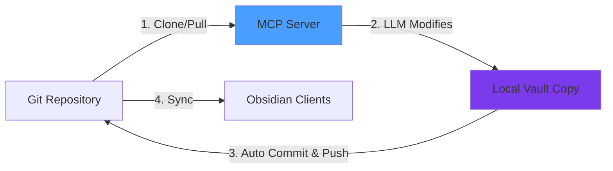

# Obsidian MCP Server

A Model Context Protocol (MCP) server for git-backed Obsidian vaults. Access and manage your notes through Claude, ChatGPT, and other LLMs by syncing changes via git.

## Table of Contents

- [Overview](#overview)
- [Quick Start](#quick-start)
- [How It Works](#how-it-works)
- [Prerequisites](#prerequisites)
- [Deployment Options](#deployment-options)
  - [Claude Desktop (Local)](#claude-desktop-local)
  - [ChatGPT & Remote Clients](#chatgpt--remote-clients)
  - [AWS Lambda](#aws-lambda)
- [Usage Examples](#usage-examples)
- [Tool Reference](#tool-reference)
- [Resources](#resources)
- [Documentation](#documentation)
- [License](#license)

## Overview

This MCP server provides **18 tools** and **1 resource** to interact with your Obsidian vault through LLMs:

**Tool Categories:**

- **File Operations** (9) - Read, create, edit, delete, move, append, and patch notes
- **Directory Operations** (3) - Create directories and list files
- **Search** (1) - Fuzzy search with relevance scoring and exact matching
- **Tag Management** (4) - Add, remove, rename, and manage tags
- **Journal Logging** (1) - Auto-log LLM activity to daily journals

**Deployment Modes:**

- **Stdio** - Local deployment for Claude Desktop, Cursor
- **HTTP** - Local/remote with OAuth for ChatGPT, Claude web
- **AWS Lambda** - Serverless deployment with DynamoDB sessions

## Quick Start

Get started with Claude Desktop in 3 steps using Docker:

```bash
# 1. Download the example environment file
curl -O https://raw.githubusercontent.com/eddmann/obsidian-mcp/main/.env.example
mv .env.example obsidian-mcp.env

# 2. Edit obsidian-mcp.env with your vault repo and git token
# Required fields:
#   VAULT_REPO=https://github.com/username/vault-repo.git
#   VAULT_BRANCH=main
#   GIT_TOKEN=your_token_here
```

**3. Add to Claude Desktop config:**

<details>
<summary>macOS: <code>~/Library/Application Support/Claude/claude_desktop_config.json</code></summary>

```json
{
  "mcpServers": {
    "obsidian": {
      "command": "docker",
      "args": [
        "run",
        "-i",
        "--rm",
        "-v",
        "/ABSOLUTE/PATH/TO/obsidian-mcp.env:/app/.env",
        "ghcr.io/eddmann/obsidian-mcp:latest",
        "stdio"
      ]
    }
  }
}
```

</details>

<details>
<summary>Windows: <code>%APPDATA%\Claude\claude_desktop_config.json</code></summary>

```json
{
  "mcpServers": {
    "obsidian": {
      "command": "docker",
      "args": [
        "run",
        "-i",
        "--rm",
        "-v",
        "C:\\ABSOLUTE\\PATH\\TO\\obsidian-mcp.env:/app/.env",
        "ghcr.io/eddmann/obsidian-mcp:latest",
        "stdio"
      ]
    }
  }
}
```

</details>

Restart Claude Desktop and start chatting with your vault!

<details>
<summary><b>Prefer npm?</b> Click here for npm-based setup</summary>

```bash
# 1. Clone and install
git clone https://github.com/eddmann/obsidian-mcp
cd obsidian-mcp
npm install

# 2. Configure credentials
cp .env.example .env
# Edit .env with your vault repo and git token
```

**3. Add to Claude Desktop config:**

**macOS:** `~/Library/Application Support/Claude/claude_desktop_config.json`

```json
{
  "mcpServers": {
    "obsidian": {
      "command": "npm",
      "args": ["run", "--prefix", "/ABSOLUTE/PATH/TO/obsidian-mcp", "dev"]
    }
  }
}
```

**Windows:** `%APPDATA%\Claude\claude_desktop_config.json`

```json
{
  "mcpServers": {
    "obsidian": {
      "command": "npm",
      "args": ["run", "--prefix", "C:\\ABSOLUTE\\PATH\\TO\\obsidian-mcp", "dev"]
    }
  }
}
```

</details>

## How It Works

This server is designed for **git-backed Obsidian vaults** managed by plugins like [obsidian-git](https://github.com/Vinzent03/obsidian-git).



**Workflow:**

1. Server clones/pulls your vault from git
2. LLM makes changes through MCP tools
3. Server automatically commits and pushes changes
4. Your Obsidian clients pull to stay synchronized

This enables LLM access without Obsidian being open, with all changes synchronized via git.

## Prerequisites

<details>
<summary><b>System Requirements</b></summary>

- Docker (recommended), OR Node.js 22+ and npm
- AWS Account (only for Lambda deployment)
</details>

<details>
<summary><b>Vault Requirements</b></summary>

1. **Git-initialized Obsidian vault** - Your vault must be a git repository
2. **Pushed to a remote** - Supports GitHub, GitLab, Bitbucket, or self-hosted
3. **Git Personal Access Token** - See [Git Providers documentation](docs/GIT_PROVIDERS.md)
4. **Sync-enabled (recommended)** - Use [obsidian-git](https://github.com/Vinzent03/obsidian-git) plugin for automatic sync
</details>

## Deployment Options

### Claude Desktop (Local)

**Using Docker:**

See [Quick Start](#quick-start) above for the recommended Docker-based setup.

<details>
<summary><b>Prefer npm?</b> Click here for npm-based setup</summary>

```bash
# Clone and install
git clone https://github.com/eddmann/obsidian-mcp
cd obsidian-mcp
npm install

# Configure credentials
cp .env.example .env
# Edit .env with your vault repo and git token
```

**Claude Desktop config:**

**macOS:** `~/Library/Application Support/Claude/claude_desktop_config.json`

```json
{
  "mcpServers": {
    "obsidian": {
      "command": "npm",
      "args": ["run", "--prefix", "/ABSOLUTE/PATH/TO/obsidian-mcp", "dev"]
    }
  }
}
```

**Windows:** `%APPDATA%\Claude\claude_desktop_config.json`

```json
{
  "mcpServers": {
    "obsidian": {
      "command": "npm",
      "args": ["run", "--prefix", "C:\\ABSOLUTE\\PATH\\TO\\obsidian-mcp", "dev"]
    }
  }
}
```

</details>

### ChatGPT & Remote Clients

Run the server in HTTP mode with OAuth authentication:

**Using Docker:**

```bash
docker run -p 3000:3000 --rm \
  -v "/ABSOLUTE/PATH/TO/obsidian-mcp.env:/app/.env" \
  ghcr.io/eddmann/obsidian-mcp:latest \
  http
```

**Using npm:**

```bash
# First clone the repo if you haven't already
git clone https://github.com/eddmann/obsidian-mcp
cd obsidian-mcp
npm install

# Configure all environment variables (including OAuth)
cp .env.example .env
# Edit .env

# Run HTTP server
npm run dev:http
```

**Required environment variables:**

- All core variables (see `.env.example`)
- OAuth variables: `OAUTH_CLIENT_ID`, `OAUTH_CLIENT_SECRET`, `PERSONAL_AUTH_TOKEN`, `BASE_URL`

See [Deployment Guide](docs/DEPLOYMENT.md#http-mode) for detailed configuration and ChatGPT integration.

### AWS Lambda

Deploy to AWS Lambda for remote access with DynamoDB session storage:

```bash
# 1. Clone the repository
git clone https://github.com/eddmann/obsidian-mcp
cd obsidian-mcp

# 2. Install dependencies
npm install

# 3. Configure all environment variables (including OAuth)
cp .env.example .env
# Edit .env

# 4. Deploy to AWS
npm run cdk:deploy
```

**What gets deployed:**

- Lambda function (ARM64, 2GB memory, 10GB storage)
- DynamoDB table with TTL-based sessions
- Function URL with CORS enabled
- CloudWatch logs (1-week retention)

**Cleanup:**

```bash
npm run cdk:destroy
```

See [Deployment Guide](docs/DEPLOYMENT.md#aws-lambda) for complete setup instructions.

## Usage Examples

Ask your LLM to interact with your vault using natural language:

<details>
<summary><b>File Operations</b></summary>

```
"Can you read my project note at Projects/MCP-Server.md?"
"Read all my daily notes from the past week"
"Create a new meeting note in Work/Meetings for today's standup"
"Add a task list to my project plan under the Action Items section"
```

</details>

<details>
<summary><b>Directory Operations</b></summary>

```
"Set up a new folder structure for my research papers"
"What markdown files do I have in my vault?"
"Show me all the PDFs in my Resources folder"
```

</details>

<details>
<summary><b>Search</b></summary>

```
"Find all my notes about machine learning"
"Where did I write about TODO items?"
"Search my Projects folder for anything about deployment"
```

</details>

<details>
<summary><b>Tag Management</b></summary>

```
"Tag my meeting note with work and urgent"
"I want to consolidate my todo tags into a single task tag"
"What tags am I using the most?"
```

</details>

<details>
<summary><b>Journal Logging</b></summary>

```
"Log today's work: I implemented OAuth for the MCP server using TypeScript and AWS"
"Add a journal entry about my Rust research - I learned about async patterns and tokio"
"Journal this: spent time learning TypeScript generics and created some helper utilities"
```

</details>

## Tool Reference

### File Operations (9 tools)

<details>
<summary>View all file operation tools</summary>

| Tool               | Description                                                                                                       |
| ------------------ | ----------------------------------------------------------------------------------------------------------------- |
| `read-note`        | Read the contents of a note file                                                                                  |
| `read-notes`       | Read multiple notes in a single request for improved efficiency (accepts array of paths, handles partial success) |
| `create-note`      | Create a new note with content (automatically creates parent directories if needed)                               |
| `edit-note`        | Replace the entire content of an existing note                                                                    |
| `delete-note`      | Permanently delete a note file from the vault                                                                     |
| `move-note`        | Move a note to a different directory or rename it                                                                 |
| `append-content`   | Append content to the end of an existing note, or create a new note if it doesn't exist                           |
| `patch-content`    | Insert or update content at specific locations: headings, block identifiers, text matches, or YAML frontmatter    |
| `apply-diff-patch` | Apply a unified diff patch to a file using standard diff format (strict matching, precise line-based changes)     |

See [Tool Documentation](docs/TOOLS.md#file-operations) for detailed usage and examples.

</details>

### Directory Operations (3 tools)

<details>
<summary>View all directory operation tools</summary>

| Tool                  | Description                                                        |
| --------------------- | ------------------------------------------------------------------ |
| `create-directory`    | Create a new directory in the vault (supports nested paths)        |
| `list-files-in-vault` | List all markdown files and directories in the vault root          |
| `list-files-in-dir`   | List all files and subdirectories within a specific directory path |

See [Tool Documentation](docs/TOOLS.md#directory-operations) for detailed usage and examples.

</details>

### Search (1 tool)

<details>
<summary>View search tool</summary>

| Tool           | Description                                                                                                              |
| -------------- | ------------------------------------------------------------------------------------------------------------------------ |
| `search-vault` | Search vault filenames and content using fuzzy matching (powered by fuse.js) or exact string matching with context lines |

See [Tool Documentation](docs/TOOLS.md#search) for detailed usage and examples.

</details>

### Tag Management (4 tools)

<details>
<summary>View all tag management tools</summary>

| Tool          | Description                                                                       |
| ------------- | --------------------------------------------------------------------------------- |
| `add-tags`    | Add hashtags to a note's YAML frontmatter or inline within the note content       |
| `remove-tags` | Remove specified hashtags from a note's frontmatter and/or inline content         |
| `rename-tag`  | Rename a tag across all notes in the vault (updates both frontmatter and inline)  |
| `manage-tags` | List all tags with usage counts, or merge multiple tags into a single unified tag |

See [Tool Documentation](docs/TOOLS.md#tag-management) for detailed usage and examples.

</details>

### Journal Logging (1 tool)

<details>
<summary>View journal logging tool</summary>

| Tool                | Description                                                                                  |
| ------------------- | -------------------------------------------------------------------------------------------- |
| `log-journal-entry` | Log timestamped activity entries to daily journal files (auto-creates journal from template) |

See [Tool Documentation](docs/TOOLS.md#journal-logging) for detailed usage and examples.

</details>

## Resources

MCP resources provide contextual information that LLMs can access on-demand.

### Vault README

| Resource       | URI                       | Description                                                                                                                  |
| -------------- | ------------------------- | ---------------------------------------------------------------------------------------------------------------------------- |
| `vault-readme` | `obsidian://vault-readme` | Provides access to the README.md file from your vault root containing organization guidelines and vault-specific conventions |

If your vault contains a README.md file in its root directory, LLMs can access it to understand how your vault is organized.

## Documentation

- **[Tool Reference](docs/TOOLS.md)** - Detailed documentation for all 18 tools with usage examples
- **[Deployment Guide](docs/DEPLOYMENT.md)** - Complete deployment instructions for all modes
- **[Git Providers](docs/GIT_PROVIDERS.md)** - Setup instructions for GitHub, GitLab, Bitbucket, and self-hosted providers

## License

[MIT](LICENSE)
